# DashboardAQ

**Real-Time Air Quality Monitoring Dashboard** — An air quality monitoring system based on Indonesia's ISPU (Indeks Standar Pencemar Udara) standard from KLHK.


---

## Key Features

- **Real-Time Monitoring** — Live PM2.5, PM10, CO, NO2, O3 sensor data via Supabase Realtime WebSocket
- **ISPU Classification** — Air Quality Index calculation per KLHK standards with Random Forest validation layer
- **ML Forecasting** — Multi-parameter 60-minute ahead predictions using XGBoost v2 with confidence intervals
- **Interactive Visualizations** — 11+ chart types (line, area, bar, calendar heatmap, gauge, box plot)
- **Dark Mode** — Light/dark theme support
- **Responsive Design** — Mobile-friendly with collapsible sidebar

---

## Tech Stack

| Layer | Technology |
|-------|-----------|
| **Framework** | Next.js 15 (App Router), React 19 |
| **Languages** | TypeScript, Python 3 |
| **Styling** | Tailwind CSS 4, shadcn/ui (Radix UI) |
| **Charting** | Recharts 2 |
| **Animations** | Framer Motion |
| **Database** | Supabase (PostgreSQL + Realtime) |
| **ML** | XGBoost v2, Random Forest, scikit-learn, pandas, numpy |
| **Runtime** | Bun, Node.js |

---

## System Architecture

```
┌─────────────────────────────────────────────────────────────┐
│                   Sensor Hardware                           │
│       PM2.5 · PM10 · CO · NO2 · O3 · Temp · Humidity        │
└─────────────────────────┬───────────────────────────────────┘
                          │
                          ▼
┌─────────────────────────────────────────────────────────────┐
│                  Supabase PostgreSQL                        │
│  ┌──────────────────┐  ┌──────────────┐  ┌──────────────┐   │
│  │ tb_konsentrasi   │  │ tb_prediksi_ │  │ tb_fitted_   │   │
│  │ _gas             │  │ hourly       │  │ values       │   │
│  └──────┬───────────┘  └──────▲───────┘  └──────▲───────┘   │
│         │                     │                  │          │
└─────────┼─────────────────────┼──────────────────┼──────────┘
          │                     │                  │
          ▼                     │                  │
┌────────────────────┐          │                  │
│  Supabase Realtime │          │                  │
│  (WebSocket)       │          │                  │
└─────────┬──────────┘          │                  │
          │                     │                  │
          ▼                     │                  │
┌────────────────────┐          │                  │
│  React Frontend    │          │                  │
│  (Next.js)         │          │                  │
│                    │          │                  │
│  OverviewTab       │          │                  │
│  HeatmapCalendar   │          │                  │
│  PeakHourBoxPlot   │          │                  │
│  DensityPlotCO     │          │                  │
└────────────────────┘          │                  │
          │                     │                  │
          │    ┌────────────────┴──────────────────┴───────┐
          │    │          ML Pipeline (Python)             │
          │    │  ┌────────────┐  ┌───────────────────┐    │
          │    │  │ Watcher    │─▶│ predict_hourly_   │    │
          │    │  │ daemon 60s │  │ multi.py          │    │
          │    │  └────────────┘  │ Feature Eng.      │    │
          │    │                  │ XGBoost v2        │    │
          │    │                  │ CI (upper/lower)  │    │
          │    │                  └────────┬──────────┘    │
          │    │                           │               │
          │    │                  ┌────────▼──────────┐    │
          │    │                  │ classify.py       │    │
          │    │                  │ Random Forest     │    │
          │    │                  │ 5-class ISPU      │    │
          │    │                  └───────────────────┘    │
          │    └───────────────────────────────────────────┘
          ▼
┌────────────────────┐
│  BMKG Public API   │
│  (Weather Data)    │
└────────────────────┘
```

---

## Installation & Setup

### Prerequisites

- Bun (or Node.js ≥ 18)
- Python 3.8+
- Supabase account (PostgreSQL)

### Steps

1. **Clone the repository**

```bash
git clone https://github.com/username/dashboardaq.git
cd dashboardaq
```

2. **Install dependencies**

```bash
bun install
```

3. **Configure environment**

Create a `.env` file in the project root:

```env
NEXT_PUBLIC_SUPABASE_URL=your_supabase_url
NEXT_PUBLIC_SUPABASE_ANON_KEY=your_supabase_anon_key
```

4. **Set up Python environment**

```bash
cd ml_model
pip install -r requirements.txt  # or: pandas numpy scikit-learn xgboost joblib
cd ..
```

5. **Run the application**

```bash
bun run dev
```

This starts the Next.js dev server (Turbopack) alongside the Python watcher daemon.

6. **Open in browser**

Navigate to [http://localhost:3000](http://localhost:3000)

---

## Machine Learning Pipeline



The prediction system uses a two-layer architecture:

### Layer 1 — ISPU Breakpoint (Official KLHK)
Computes the Air Quality Index using official breakpoint tables for PM2.5, PM10, CO, NO2, and O3.

### Layer 2 — Random Forest Classification
A machine learning validation layer to ensure classification consistency.

### Forecasting Process

1. **Watcher daemon** (`live_forecast_watcher.py`) runs every 60 seconds
2. Checks for sensor data availability within the last 30 minutes
3. **Feature engineering**: lag features (1/5/15/60 min), rolling statistics, time features (hour, dayofweek, etc.)
4. **XGBoost v2** performs recursive multi-step 60-minute forecasting with confidence intervals (upper/lower bounds)
5. **Fallback** to Holt-Winters exponential smoothing when XGBoost models are unavailable
6. Results are saved to `tb_prediksi_hourly` and pushed to the frontend via Realtime

---

## Project Structure

```
src/
├── app/
│   ├── api/                    # API route handlers
│   │   ├── aggregates/         # Data aggregation endpoints
│   │   ├── classify/           # ISPU + RF classification
│   │   ├── forecast/           # Forecasting endpoints
│   │   └── regression/         # Linear regression
│   ├── globals.css             # Tailwind v4 + CSS variables
│   ├── layout.tsx              # Root layout
│   ├── page.tsx                # Home (/) dashboard
│   ├── statistik/              # Statistics page
│   ├── pengaturan/             # Settings page
│   └── tentang/                # About page
├── components/
│   ├── ui/                     # 53 shadcn/ui components
│   ├── OverviewTab.tsx         # Main dashboard visualizations
│   ├── Sidebar.tsx             # Collapsible navigation
│   ├── HeatmapCalendar.tsx     # Monthly PM2.5 calendar heatmap
│   ├── DensityPlotCO.tsx       # CO ISPU density area chart
│   ├── HourlyForecastClassification.tsx
│   ├── MLForecastPrototype.tsx
│   └── PeakHourBoxPlot.tsx
├── lib/
│   ├── supabase.ts             # Supabase client
│   ├── utils.ts                # cn() utility
│   └── limits.ts               # Parameter limits
└── types/
    └── index.ts                # TypeScript type definitions

ml_model/
├── live_forecast_watcher.py    # Daemon watcher (60s interval)
├── predict_hourly_multi.py     # Multi-parameter XGBoost forecasting
├── classify.py                 # Random Forest classification
├── xgb_pm25_v2.pkl             # XGBoost PM2.5 model
├── xgb_pm10_v2.pkl             # XGBoost PM10 model
├── xgb_co_v2.pkl               # XGBoost CO model
└── random_forest_air_quality.pkl
```

---

## API Endpoints

| Endpoint | Description |
|----------|-------------|
| `GET /api/classify` | ISPU + Random Forest classification |
| `GET /api/forecast` | Forecast data (historical + predicted) |
| `GET /api/forecast/hourly` | 60-minute ahead prediction |
| `GET /api/forecast/trigger` | Manually trigger forecast |
| `GET /api/regression` | Linear regression between parameters |
| `GET /api/aggregates/daily-pm25` | Daily PM2.5 averages |
| `GET /api/aggregates/hourly-pattern` | Weekday vs weekend hourly patterns |
| `GET /api/aggregates/peak-hour-distribution` | Peak hour distribution |
| `GET /api/aggregates/co-density` | CO ISPU density distribution |
| `GET /api/aggregates/percentiles` | Monthly percentile statistics |
| `GET /api/aggregates/pollution-rose` | PM2.5 by wind direction |

---

## ISPU Categories

| Range | Category | Color |
|-------|----------|-------|
| 0–50 | Good | Green |
| 51–100 | Moderate | Blue |
| 101–200 | Unhealthy | Yellow |
| 201–300 | Very Unhealthy | Red |
| 301–500 | Hazardous | Purple |

---

## License

This project is developed for academic purposes.
