# DashboardAQ

**Real-Time Air Quality Monitoring Dashboard** — Pemantauan kualitas udara berbasis standar ISPU (Indeks Standar Pencemar Udara) KLHK Indonesia.


---

## Fitur Utama

- **Pemantauan Real-Time** — Data sensor PM2.5, PM10, CO, NO2, O3 diperbarui secara langsung melalui Supabase Realtime WebSocket
- **Klasifikasi ISPU** — Perhitungan Indeks Standar Pencemar Udara sesuai standar KLHK dengan lapisan validasi Random Forest
- **Prediksi ML** — Forecast multi-parameter 60 menit ke depan menggunakan XGBoost v2 dengan confidence interval
- **Visualisasi Interaktif** — 11+ jenis grafik (line chart, area chart, bar chart, heatmap kalender, gauge, box plot)
- **Dark Mode** — Dukungan tema terang/gelap
- **Responsive Design** — Tampilan mobile-friendly dengan sidebar collapsible

---

## Tech Stack

| Layer | Teknologi |
|-------|-----------|
| **Framework** | Next.js 15 (App Router), React 19 |
| **Bahasa** | TypeScript, Python 3 |
| **Styling** | Tailwind CSS 4, shadcn/ui (Radix UI) |
| **Charting** | Recharts 2 |
| **Animasi** | Framer Motion |
| **Database** | Supabase (PostgreSQL + Realtime) |
| **ML** | XGBoost v2, Random Forest, scikit-learn, pandas, numpy |
| **Runtime** | Bun, Node.js |

---

## Arsitektur Sistem



---

## Instalasi & Menjalankan

### Prasyarat

- Bun (atau Node.js ≥ 18)
- Python 3.8+
- Akun Supabase (PostgreSQL)

### Langkah-langkah

1. **Clone repositori**

```bash
git clone https://github.com/username/dashboardaq.git
cd dashboardaq
```

2. **Install dependensi**

```bash
bun install
```

3. **Konfigurasi environment**

Buat file `.env` di root proyek:

```env
NEXT_PUBLIC_SUPABASE_URL=your_supabase_url
NEXT_PUBLIC_SUPABASE_ANON_KEY=your_supabase_anon_key
```

4. **Siapkan Python environment**

```bash
cd ml_model
pip install -r requirements.txt  # atau: pandas numpy scikit-learn xgboost joblib
cd ..
```

5. **Jalankan aplikasi**

```bash
bun run dev
```

Perintah ini akan menjalankan Next.js dev server (Turbopack) bersamaan dengan Python watcher daemon.

6. **Buka browser**

Navigasi ke [http://localhost:3000](http://localhost:3000)

---

## Machine Learning Pipeline


Sistem prediksi menggunakan arsitektur dua lapis:

### Layer 1 — ISPU Breakpoint (Official KLHK)
Menghitung Indeks Standar Pencemar Udara berdasarkan tabel breakpoint resmi untuk PM2.5, PM10, CO, NO2, dan O3.

### Layer 2 — Random Forest Classification
Model machine learning sebagai lapisan validasi untuk memastikan konsistensi klasifikasi.

### Proses Forecasting

1. **Watcher daemon** (`live_forecast_watcher.py`) berjalan setiap 60 detik
2. Mengecek ketersediaan data sensor 30 menit terakhir
3. **Feature engineering**: lag features (1/5/15/60 menit), rolling statistics, time features (hour, dayofweek, dll.)
4. **XGBoost v2** melakukan recursive multi-step forecast 60 menit ke depan dengan confidence interval (upper/lower bound)
5. **Fallback** ke Holt-Winters exponential smoothing jika model XGBoost tidak tersedia
6. Hasil disimpan ke `tb_prediksi_hourly` dan dikirim ke frontend via Realtime

---

## Struktur Proyek

```
src/
├── app/
│   ├── api/                    # API route handlers
│   │   ├── aggregates/         # Data aggregation endpoints
│   │   ├── classify/           # ISPU + RF classification
│   │   ├── forecast/           # Forecasting endpoints
│   │   └── regression/         # Linear regression
│   ├── globals.css             # Tailwind v4 + CSS variables
│   ├── layout.tsx              # Root layout
│   ├── page.tsx                # Home (/) dashboard
│   ├── statistik/              # Statistics page
│   ├── pengaturan/             # Settings page
│   └── tentang/                # About page
├── components/
│   ├── ui/                     # 53 shadcn/ui components
│   ├── OverviewTab.tsx         # Main dashboard visualizations
│   ├── Sidebar.tsx             # Collapsible navigation
│   ├── HeatmapCalendar.tsx     # Monthly PM2.5 calendar heatmap
│   ├── DensityPlotCO.tsx       # CO ISPU density area chart
│   ├── HourlyForecastClassification.tsx
│   ├── MLForecastPrototype.tsx
│   └── PeakHourBoxPlot.tsx
├── lib/
│   ├── supabase.ts             # Supabase client
│   ├── utils.ts                # cn() utility
│   └── limits.ts               # Parameter limits
└── types/
    └── index.ts                # TypeScript type definitions

ml_model/
├── live_forecast_watcher.py    # Daemon watcher (60s interval)
├── predict_hourly_multi.py     # Multi-parameter XGBoost forecasting
├── classify.py                 # Random Forest classification
├── xgb_pm25_v2.pkl             # XGBoost PM2.5 model
├── xgb_pm10_v2.pkl             # XGBoost PM10 model
├── xgb_co_v2.pkl               # XGBoost CO model
└── random_forest_air_quality.pkl
```

---

## API Endpoints

| Endpoint | Deskripsi |
|----------|-----------|
| `GET /api/classify` | Klasifikasi ISPU + Random Forest |
| `GET /api/forecast` | Data forecast (historis + prediksi) |
| `GET /api/forecast/hourly` | Prediksi 60 menit ke depan |
| `GET /api/forecast/trigger` | Trigger manual forecast |
| `GET /api/regression` | Regresi linear antar parameter |
| `GET /api/aggregates/daily-pm25` | Rata-rata PM2.5 harian |
| `GET /api/aggregates/hourly-pattern` | Pola jam-an weekday vs weekend |
| `GET /api/aggregates/peak-hour-distribution` | Distribusi jam sibuk |
| `GET /api/aggregates/co-density` | Kepadatan CO ISPU |
| `GET /api/aggregates/percentiles` | Statistik persentil bulanan |
| `GET /api/aggregates/pollution-rose` | Konsentrasi PM2.5 per arah angin |

---

## Kategori ISPU

| Rentang | Kategori | Warna |
|---------|----------|-------|
| 0–50 | Baik | Hijau |
| 51–100 | Sedang | Biru |
| 101–200 | Tidak Sehat | Kuning |
| 201–300 | Sangat Tidak Sehat | Merah |
| 301–500 | Berbahaya | Ungu |

---

## Lisensi

Proyek ini dikembangkan untuk keperluan akademik.
