# Diagram Arsitektur Sistem - DashboardAQ v3.0

```mermaid
flowchart TB
    subgraph SENSOR["🌡️ Sensor Hardware"]
        S1["Sensor PM2.5"]
        S2["Sensor PM10"]
        S3["Sensor CO"]
        S4["Sensor NO2"]
        S5["Sensor O3"]
        S6["Sensor Suhu & Kelembaban"]
    end

    subgraph DATABASE["🗄️ Supabase PostgreSQL"]
        DB1["tb_konsentrasi_gas\n(Raw sensor data)"]
        DB2["tb_prediksi_hourly\n(Hourly forecasts)"]
        DB3["tb_fitted_values\n(In-sample predictions)"]
        DB4["air_quality_hourly_agg\n(Aggregated data)"]
        DB5["tb_prediksi_kualitas_udara\n(Legacy predictions)"]
    end

    subgraph REALTIME["⚡ Supabase Realtime"]
        RT1["WebSocket\nSubscriptions"]
    end

    subgraph BACKEND["🖥️ Backend - Next.js API Routes"]
        API1["/api/classify\nISPU + RF Classification"]
        API2["/api/forecast\nForecast data"]
        API3["/api/forecast/hourly\n60-min prediction"]
        API4["/api/forecast/trigger\nManual trigger"]
        API5["/api/regression\nLinear regression"]
        API6["/api/aggregates/*\nData aggregation:\ndaily-pm25, hourly-pattern,\npeak-hour, co-density,\npercentiles, pollution-rose"]
    end

    subgraph ML_PIPELINE["🧠 ML Pipeline (Python)"]
        WATCHER["live_forecast_watcher.py\n(daemon every 60s)"]
        XGBOOST["predict_hourly_multi.py\nXGBoost v2 Recursive\n60-step forecast"]
        RF["classify.py\nRandom Forest\n5-class ISPU"]
        FALLBACK["Holt-Winters\nExponential Smoothing\n(fallback)"]
    end

    subgraph FRONTEND["🎨 React Frontend (Next.js App Router)"]
        PAGE1["/ (Overview)\nDashboard utama"]
        PAGE2["/statistik\nAnalisis & Forecast"]
        PAGE3["/pengaturan\nSettings"]
        PAGE4["/tentang\nAbout"]
        COMP1["OverviewTab.tsx\nAll visualizations"]
        COMP2["HeatmapCalendar.tsx\nMonthly heatmap"]
        COMP3["PeakHourBoxPlot.tsx\nPeak distribution"]
        COMP4["DensityPlotCO.tsx\nCO density"]
        COMP5["HourlyForecastClassification.tsx\n1-hour forecast"]
        COMP6["MLForecastPrototype.tsx\nMulti-parameter forecast"]
    end

    subgraph EXTERNAL["🌐 External"]
        BMKG["BMKG Public API\n(Cuaca Surabaya)"]
    end

    %% Sensor → Database
    S1 & S2 & S3 & S4 & S5 & S6 --> DB1

    %% Database → Backend
    DB1 --> API1 & API5 & API6
    DB4 --> API6
    DB2 --> API2 & API3

    %% Database → Realtime → Frontend
    DB1 --> RT1
    RT1 --> FRONTEND

    %% Database → ML Pipeline
    DB1 --> WATCHER
    WATCHER --> XGBOOST
    XGBOOST --> RF
    XGBOOST --> FALLBACK
    FALLBACK --> DB2
    RF --> DB2
    XGBOOST --> DB3

    %% Backend → Frontend
    API1 & API2 & API3 & API4 & API5 & API6 --> FRONTEND

    %% External
    BMKG --> COMP1

    %% Styling
    classDef sensor fill:#e74c3c,color:#fff,stroke:#c0392b
    classDef db fill:#3498db,color:#fff,stroke:#2980b9
    classDef realtime fill:#2ecc71,color:#fff,stroke:#27ae60
    classDef backend fill:#9b59b6,color:#fff,stroke:#8e44ad
    classDef ml fill:#e67e22,color:#fff,stroke:#d35400
    classDef frontend fill:#1abc9c,color:#fff,stroke:#16a085
    classDef external fill:#95a5a6,color:#fff,stroke:#7f8c8d

    class S1,S2,S3,S4,S5,S6 sensor
    class DB1,DB2,DB3,DB4,DB5 db
    class RT1 realtime
    class API1,API2,API3,API4,API5,API6 backend
    class WATCHER,XGBOOST,RF,FALLBACK ml
    class PAGE1,PAGE2,PAGE3,PAGE4,COMP1,COMP2,COMP3,COMP4,COMP5,COMP6 frontend
    class BMKG external
```

## Alur Data Utama

1. **Sensor → Database**: Hardware mengirim data konsentrasi gas ke `tb_konsentrasi_gas`
2. **Database → ML Pipeline**: Python watcher membaca data terbaru setiap 60 detik
3. **ML → Database**: Hasil forecast disimpan ke `tb_prediksi_hourly` & `tb_fitted_values`
4. **Database → Realtime → Frontend**: WebSocket mendorong data ke UI secara real-time
5. **Database → Backend API → Frontend**: API Routes menyediakan data agregat untuk visualisasi
6. **BMKG API → Frontend**: Data cuaca eksternal untuk konteks tambahan
