# Diagram Pipeline Machine Learning - DashboardAQ v3.0

```mermaid
flowchart TB
    subgraph TRIGGER["⏱️ Trigger (Every 60 seconds)"]
        DAEMON["live_forecast_watcher.py\nRunning as daemon"]
        CHECK["Cek: sensor_has_recent_data()\nApakah ada data sensor\n< 30 menit terakhir?"]
        CONDITION{"Data tersedia?"}
    end

    subgraph FETCH["📥 Data Fetching"]
        FETCH_DATA["fetch_recent_data()\nAmbil 4320 menit data sensor\ndari tb_konsentrasi_gas"]
        PARAMS["Parameter:\n• pm25_ugm3\n• pm10_ugm3\n• co_ugm3\n• temperature\n• humidity"]
    end

    subgraph FEATURES["🔧 Feature Engineering (build_features())"]
        LAG["Lag Features:\n• lag_1min\n• lag_5min\n• lag_15min\n• lag_60min"]
        ROLLING["Rolling Statistics:\n• rolling_5min_mean\n• rolling_5min_std\n• rolling_15min_mean"]
        TIME["Time Features:\n• minute\n• hour\n• dayofweek\n• day_sin / day_cos"]
    end

    subgraph MODEL["🤖 XGBoost v2 Forecasting (forecast_all_params())"]
        XGB_PM25["xgb_pm25_v2.pkl\nPM2.5 Model"]
        XGB_PM10["xgb_pm10_v2.pkl\nPM10 Model"]
        XGB_CO["xgb_co_v2.pkl\nCO Model"]
        RECURSIVE["Recursive 60-step\nmulti-stage forecast"]
        CI["Confidence Interval:\n• Upper bound (95%)\n• Lower bound (95%)"]
    end

    subgraph FALLBACK["⚠️ Fallback Mechanism"]
        HOLTWINTERS["Holt-Winters\nExponential Smoothing"]
        COND_FALLBACK{"XGBoost\nmodels loaded?"}
    end

    subgraph CLASSIFY["🏷️ ISPU Classification (classify_forecast())"]
        RF_MODEL["random_forest_air_quality.pkl\nRandom Forest Classifier"]
        CATEGORIES["5 Kategori:\n• Baik (0-50)\n• Sedang (51-100)\n• Tidak Sehat (101-200)\n• Sangat Tidak Sehat (201-300)\n• Berbahaya (301-500)"]
        CONFIDENCE["Confidence Score\nProbabilitas prediksi"]
    end

    subgraph SAVE["💾 Save Results"]
        SAVE_HOURLY["save_hourly_predictions()\nUpsert ke tb_prediksi_hourly\n• forecast_at, target_at\n• pm25_pred, upper, lower\n• pm10_pred, upper, lower\n• co_pred, upper, lower\n• ispu, category"]
        SAVE_FITTED["save_fitted_values()\nUpsert ke tb_fitted_values\n• timestamp\n• pm25_actual vs pm25_fitted\n• pm10_actual vs pm10_fitted\n• co_actual vs co_fitted"]
    end

    subgraph FRONTEND_DISPLAY["📊 Frontend Display"]
        FORECAST_PAGE["/statistik\nHourlyForecastClassification.tsx\nMLForecastPrototype.tsx"]
        REALTIME_UPDATE["Supabase Realtime\nAuto-refresh setiap\nada data baru"]
    end

    %% Flow
    DAEMON --> CHECK
    CHECK --> CONDITION
    CONDITION -->|"Ya"| FETCH_DATA
    CONDITION -->|"Tidak\n(tunggu 60s)"| DAEMON

    FETCH_DATA --> PARAMS
    PARAMS --> LAG
    LAG --> ROLLING
    ROLLING --> TIME

    TIME --> COND_FALLBACK
    COND_FALLBACK -->|"Available"| XGB_PM25
    COND_FALLBACK -->|"Available"| XGB_PM10
    COND_FALLBACK -->|"Available"| XGB_CO
    COND_FALLBACK -->|"Not Available"| HOLTWINTERS

    XGB_PM25 & XGB_PM10 & XGB_CO --> RECURSIVE
    RECURSIVE --> CI

    HOLTWINTERS --> CI

    CI --> RF_MODEL
    RF_MODEL --> CATEGORIES
    CATEGORIES --> CONFIDENCE

    CONFIDENCE --> SAVE_HOURLY
    CONFIDENCE --> SAVE_FITTED

    SAVE_HOURLY --> SUPABASE_DB["tb_prediksi_hourly\n(Supabase)"]
    SAVE_FITTED --> SUPABASE_DB2["tb_fitted_values\n(Supabase)"]
    SUPABASE_DB & SUPABASE_DB2 --> REALTIME_UPDATE
    REALTIME_UPDATE --> FORECAST_PAGE

    %% Styling
    classDef trigger fill:#2c3e50,color:#fff
    classDef fetch fill:#3498db,color:#fff
    classDef feature fill:#9b59b6,color:#fff
    classDef model fill:#e67e22,color:#fff
    classDef fallback fill:#e74c3c,color:#fff
    classDef classify fill:#2ecc71,color:#fff
    classDef save fill:#1abc9c,color:#fff
    classDef display fill:#f39c12,color:#fff
    classDef db fill:#34495e,color:#fff

    class DAEMON,CHECK,CONDITION trigger
    class FETCH_DATA,PARAMS fetch
    class LAG,ROLLING,TIME feature
    class XGB_PM25,XGB_PM10,XGB_CO,RECURSIVE,CI model
    class HOLTWINTERS,COND_FALLBACK fallback
    class RF_MODEL,CATEGORIES,CONFIDENCE classify
    class SAVE_HOURLY,SAVE_FITTED save
    class FORECAST_PAGE,REALTIME_UPDATE display
    class SUPABASE_DB,SUPABASE_DB2 db
```

## Detail Pipeline

| Tahap | Script | Fungsi | Frekuensi |
|-------|--------|--------|-----------|
| Trigger | `live_forecast_watcher.py` | Cek data sensor baru | Setiap 60 detik |
| Training Data | `predict_hourly_multi.py:fetch_recent_data()` | Ambil 4320 menit riwayat | Setiap siklus |
| Feature Engineering | `predict_hourly_multi.py:build_features()` | Lag, rolling stats, time features | Setiap siklus |
| Forecasting | `predict_hourly_multi.py:forecast_all_params()` | XGBoost recursive 60-step | Setiap siklus |
| Fallback | Holt-Winters | Jika model XGBoost gagal load | Jika diperlukan |
| Classification | `classify.py` / Random Forest | Klasifikasi 5 kategori ISPU | Setelah forecast |
| Save | `predict_hourly_multi.py:save_*()` | Upsert ke Supabase | Setiap siklus |

## Diagram Files

| Versi | File | Dimensi | Rasio | Cocok untuk |
|-------|------|---------|-------|-------------|
| HD (Tall) | `docs/diagrams/ml_pipeline_hd.svg` | 1588 x 5196 | 1:3.3 | Dokumentasi detail |
| Compact (Horizontal) | `docs/diagrams/ml_pipeline_compact.svg` | 3170 x 580 | 5.5:1 | Layar lebar / slide |
| Square (Box) | `docs/diagrams/ml_pipeline_square.svg` | 1150 x 950 | 1.2:1 | **Lampiran email/dokumen** |
